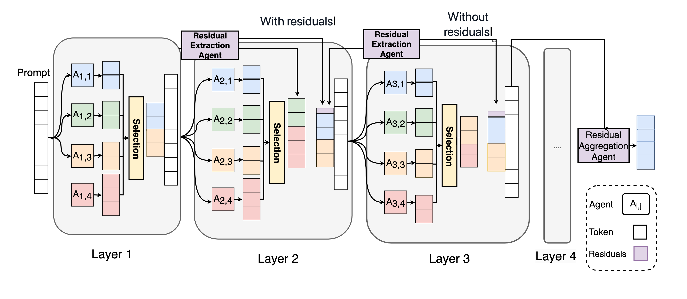

# Residual Mixture-of-Agents(RMoA)

# Overview
Although multi-agent systems based on large language models show strong capabilities on multiple tasks, they are still limited by high computational overhead, information loss, and robustness. Inspired by ResNet’s residual learning, we propose Residual Mixture-of-Agents (RMoA), integrating residual connections to optimize efficiency and reliability. To maximize information utilization from model responses while minimizing computational costs, we innovatively design an embedding-based diversity selection mechanism that greedily selects responses via vector similarity. Furthermore, to mitigate iterative information degradation, we introduce a Residual Extraction Agent to preserve cross-layer incremental information by capturing inter-layer response differences, coupled with a Residual Aggregation Agent for hierarchical information integration. Additionally, we propose an adaptive termination mechanism that dynamically halts processing based on residual convergence, further improving inference efficiency. RMoA achieves state-of-the-art performance on the benchmarks of across alignment, mathematical reasoning, code generation, and multitasking understanding, while significantly reducing computational overhead.

# Quickstart

## Preparation
1. `conda create -n RMoA python=3.9 -y`
2. `pip install -r requirements.txt`
3. `cd FlagEmbedding`
4. `pip install -e .`
5. `cd ../`
6. download bge-m3 model`python download_models.py`

## Run your RMoA by Together API
1. `pip install together`
2. Get your Together API Key & export it: `export TOGETHER_API_KEY=`
3. Run the python file: `python test_rmoa.py`

## Run your RMoA by vllm interence
1. `pip install vllm`

